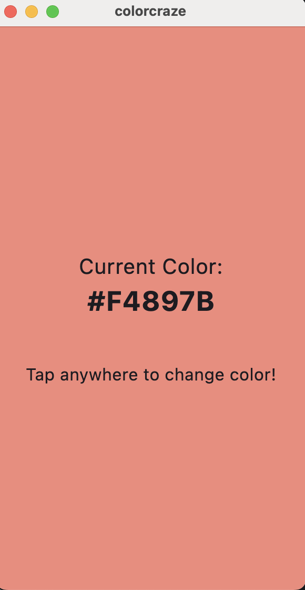
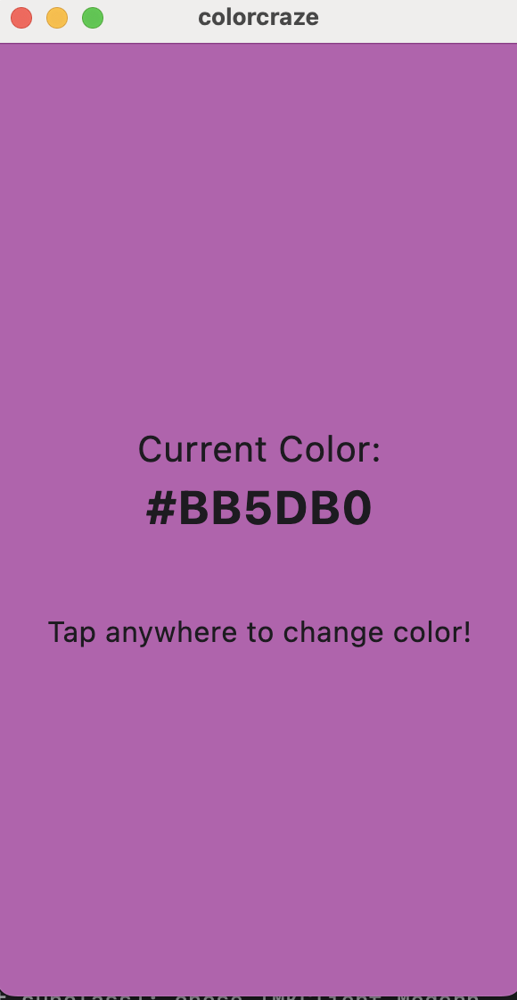
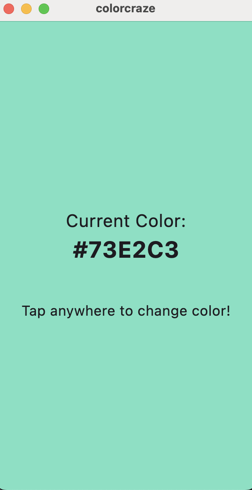

## 🎨 App Idea: **"Color Craze" — A Fun Color Generator**

### 🔧 What It Does:

* Every time the user taps the screen, the app:

    * Changes the background to a **random color**
    * Shows a **fun animated text** (e.g., “Whoa!”, “Boom!”, “Yay!”)
    * Updates the displayed **hex color code**

### 📦 Packages Used:

* [`random_color`](https://pub.dev/packages/random_color) — generates beautiful random colors
* [`animated_text_kit`](https://pub.dev/packages/animated_text_kit) — displays fun animated text

---

## ✅ Features:

* Tappable full-screen for color change
* Animated reaction text (e.g., Typewriter or Flicker style)
* Color hex code display
* Smooth, eye-catching UI for engagement

---

## 📄 README.md (for submission)

````markdown
# 🎨 Color Craze – A Flutter Color Generator

## 🔍 Overview
Color Craze is a fun, interactive Flutter app that lets users tap the screen to generate a new background color with a playful animated message. Great for UI exploration or just passing time creatively!

## 🚀 Features
- Tap anywhere to change the color!
- Random, vibrant background colors
- Animated text effects (like "Boom!", "Yay!", etc.)
- Shows the hex code of the current color

## 📦 Packages Used
- `random_color` – generates random colors
- `animated_text_kit` – displays fun animated text

## 📱 Screenshots




````

